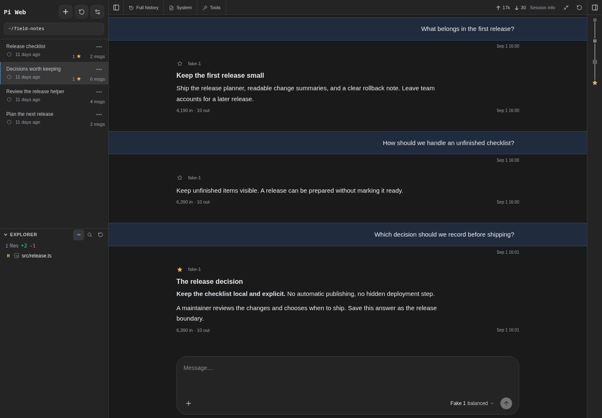

# Pi Web

**Your Pi conversations, project files, and changes in one workspace.**

Read an answer, review its diff, and write the next request with both still in
view. Pi Web gives your [Pi coding agent](https://github.com/earendil-works/pi)
a browser interface for everyday project work.

It uses the Pi configuration and session files already on your computer. Pick up
a terminal session in the browser, choose a model, and keep going. Your history
stays with Pi.

**[Get started](#get-started)** · [Explore the interface](#look-closer) ·
[What you can do](#what-you-can-do)


_The answer and the working-tree diff share the screen. The next request is
ready in the composer. All screenshots show the current UI with fictional
sessions and a local example project._

## Why Pi Web

- **Little magic.** Pi's session files stay authoritative. Live turns run
  through Pi's SDK in the server process; tools and orchestration come from Pi
  and your extensions.
- **Care in the details.** Distinct user messages, collapsible process details,
  starred answers, and previews of earlier prompts help you find your place.
  Files, diffs, model controls, and context information stay close to the work.
- **Work only when needed.** Browsing saved sessions does not start an agent.
  The session list reads bounded metadata, history loads progressively, and live
  updates stream to the browser.

This is a personalized fork of [agegr/pi-web](https://github.com/agegr/pi-web),
shaped around its maintainer's daily workflow. It is not intended to stay
compatible with upstream.

## Look closer

### Find the answer you wanted to keep

Star an answer to mark a decision, useful explanation, or result. The sidebar
shows each session's star count, and stars in the desktop navigation rail take
you back to those answers.

Hover over a square in the rail to preview an earlier prompt before jumping to
it. The popover shows up to 100 characters, with extra whitespace collapsed.
Earlier prompts remain available as you browse a long session.



_Stars are saved in the Pi session. Remove them individually, or choose **Clear
all stars** from the session menu when you're ready to start fresh._

### Read the result, then inspect the process

Keep process details collapsed while you read the answer. Expand them to inspect
reasoning, tool calls, command output, or a subagent's result. Subagent reviews
show their completion status and readable results, with the original prompt, run
details, and raw output available in separate disclosures.


_Subagent tools come from your installed Pi extensions. Pi Web displays their
results within the conversation._

### Discuss a plan in more than plain text

Read formatted tables and highlighted code alongside the answer. Mermaid blocks
switch between source and diagram preview in place. Choose light, dark, or
system appearance.


### Keep working on a smaller screen

The mobile layout gives the conversation the screen. Message actions stay
visible, and the composer keeps model and reasoning choices together. Open the
sidebar or file panel when you need them. Install Pi Web as a PWA for an app
window of its own.

<p align="center">
  
</p>

_The mobile layout, shown in browser emulation. Pi Web still runs on your host
computer; see [Security](#security) before making it reachable from another
device._

## What you can do

- Browse, activate, stop, rename, export, fork, clone, and delete Pi sessions.
  Rewind to an earlier message, branch within a session, or copy history into a
  new session. Sessions from the same repository stay together.
- Star useful answers, jump between prompts and stars on the desktop rail, and
  preview earlier prompts on hover. Clear a session's stars from its menu.
- Run agent turns with model and reasoning-level controls. You can steer work in
  progress, queue a follow-up, compact context, stop a run, attach images, and
  use slash commands.
- Read the result without losing the process. Expand reasoning, tool calls,
  command output, and subagent results, with token usage, context, and active
  time available alongside them.
- Work with project files beside the conversation. Browse files, preview common
  source and document formats, inspect Git changes, and insert file or line
  references into the composer.
- Select existing working folders and Git worktrees from one project picker. A
  session remains readable even if its original folder no longer exists.
- Manage Pi skills and plugin packages for the global scope or a trusted
  project. Pi controls the runtime's tools and resource discovery.
- Install Pi Web as a PWA and receive browser notifications when a task finishes
  or an extension needs input.

## Get started

Pi Web requires Node.js 22.19.0 or newer, npm, and a separate Pi installation.
Install Pi and make sure its `pi` executable is on `PATH`:

```bash
npm install -g --ignore-scripts @earendil-works/pi-coding-agent @earendil-works/pi-server
```

Pi Web validates the host installation as a set and requires
`@earendil-works/pi-server` alongside Pi. With a version manager that keeps each
tool in its own directory, such as mise, install both as separate tools and run
Pi Web from a shell where that manager is active.

If Pi does not have a model provider yet, configure one in the Pi terminal. Pi
Web ignores any `pi` left in the checkout's `node_modules/.bin`, then uses the
first matching `pi` executable on `PATH` (with executable extensions from
`PATHEXT` on Windows) and loads that installation's packages in-process. A
version-manager shim that is not itself inside Pi's package, such as `mise`'s
generic shim directory, is reported as an error rather than searched past.

Pi Web supports Linux, macOS, and Windows. Android and Termux are not supported.

Clone this fork and start the development server:

```bash
git clone https://github.com/mjakl/pi-web.git
cd pi-web
npm install
npm run dev
```

Open [http://127.0.0.1:30141](http://127.0.0.1:30141) when the server is ready.
For the production server and installable PWA, stop the development server, then
run:

```bash
npm run build
npm start
```

To update a checkout, stop the server and refresh the code and dependencies:

```bash
git pull --ff-only
npm install
```

Then restart the development server, or rebuild before starting the production
server. The checkout installs no Pi packages of its own: `npm install`,
`npm run dev`, `npm run build`, and `npm test` point the checkout at the Pi
found on `PATH`, so updating Pi is enough to update what Pi Web runs.

## What stays with Pi and Git

- **Worktrees and branches:** Pi Web discovers existing worktrees and switches
  between their folders. It does not create, delete, prune, or change branches
  in a worktree. Use Git or another worktree tool for those operations. See
  [Worktrees in Pi Web](./docs/worktrees.md).
- **Provider accounts and model configuration:** Sign in, add API keys, and edit
  provider or model metadata in the Pi terminal. Pi Web does not read, write, or
  serve credentials; it lists the models made available by Pi and lets you
  select one for a session.
- **Agent extensions:** Tools and subagent orchestration come from Pi and the
  extensions you install. This fork does not add a separate subagent runtime or
  profile editor.
- **Updates:** Update the checkout and your host Pi installation with their
  normal tools, then restart Pi Web. There is no browser-based updater.

## Data, files, and network access

- Pi Web reads Pi data from `~/.pi/agent` by default. Set `PI_CODING_AGENT_DIR`
  before startup to use another agent directory.
- Session files stay under Pi's `sessions/<encoded-cwd>/` directories and must
  be readable. History remains available if its working folder disappears;
  running the session requires that folder.
- Pi Web stores observed folder-to-repository associations in
  `web-worktree-projects.json` in the agent directory. Web Push uses
  `web-push.json` there for notification subscriptions and VAPID keys.
- Explorer file-content access is limited to working directories, known project
  or session roots, and explicitly selected folders. The workspace picker and
  path completion can list other readable directories; selecting a workspace
  grants access to that folder.
- Type `@` in the composer to find project files. `@~/`, `@/`, `@./`, and `@../`
  complete paths one directory at a time.
- Server-side model and API requests honor `HTTP_PROXY`, `HTTPS_PROXY`, and
  `NO_PROXY`.

Checkout scripts, including the explicit LAN variants, are listed in
[`package.json`](./package.json).

## Security

Pi Web can run agent tools and project commands. It has no user accounts, login
screen, or built-in authentication, and does not restrict request Host or Origin
headers. Keep the default `127.0.0.1` binding unless you have a trusted network
or an external access-control layer.

Project resources can run local code. Pi Web leaves project extensions, skills,
and other trust-requiring resources disabled until you trust the project. Trust
only repositories you control or have reviewed.

## Maintaining a fork

This repository is not seeking outside contributions. If Pi Web suits you, fork
it and adapt your copy.

- [Development](./docs/development.md): pinned tool setup, checks, focused
  tests, and dev-server troubleshooting. The standard validation command is
  `just ci` (or `npm run ci`).
- [Repository guide](./AGENTS.md): module ownership, project boundaries, and
  task-specific instructions for coding agents.
- [Packaging](./docs/packaging.md): disposable build and installed-package smoke
  checks when changing dependencies or packaging.

## License

[MIT](./LICENSE)
