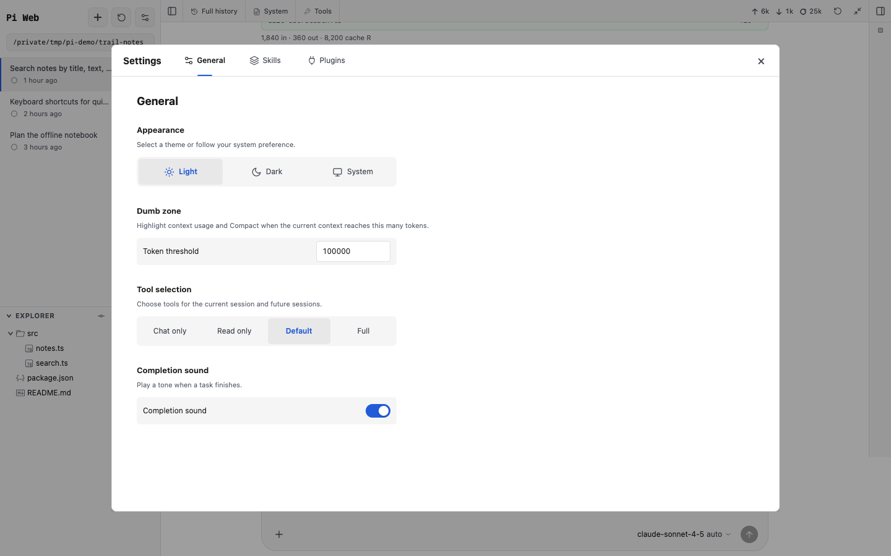

# Pi Web

Pi Web is a local browser interface for the [Pi coding agent](https://github.com/earendil-works/pi). It works with the Pi configuration and sessions already on your computer, so you can move between the terminal and browser without maintaining a second set of conversations or settings.

This repository is a personalized fork of [agegr/pi-web](https://github.com/agegr/pi-web). It follows its maintainer's workflow and is not intended to stay compatible with upstream.


## What you can do

- Browse, resume, rename, export, fork, clone, and delete Pi sessions. Branch history stays navigable, and sessions from the same repository stay together.
- Run agent turns with model, reasoning-level, and tool controls. You can steer work in progress, queue a follow-up, compact context, stop a run, attach images, and use slash commands.
- Read the result without losing the process. Pi Web renders assistant messages, reasoning, tool calls, command output, file changes, token usage, context, and active time.
- Work with project files beside the conversation. Browse or upload files, preview common source and document formats, inspect Git changes, and insert file or line references into the composer.
- Select existing working folders and Git worktrees from one project picker. A session remains readable even if its original folder no longer exists.
- Manage Pi skills and plugin packages for the global scope or a trusted project. Choose between Chat only, Read only, Default, and Full tool presets.
- Install Pi Web as a PWA and receive browser notifications when a task finishes or an extension needs input.


*Open a changed file from the Explorer to review its diff without leaving the session.*



*Settings keep common controls together; project skills and plugins load only after you trust the project.*

## What Pi Web does not manage

Pi Web is a client for Pi and your existing working folders, not a replacement for either one.

- **Git worktrees and branches:** Pi Web discovers existing worktrees and switches between their folders. It does not create, delete, prune, or change branches in a worktree. Use Git or another worktree tool for those operations. See [Worktrees in Pi Web](./docs/worktrees.md).
- **Provider accounts and model configuration:** Sign in, add API keys, and edit provider or model metadata in the Pi terminal. Pi Web does not read, write, or serve credentials; it lists the models made available by Pi and lets you select one for a session.
- **Remote access control:** Pi Web has no user accounts, login screen, or built-in authentication. The default loopback address is intended for local use. Protect any non-loopback deployment with a trusted network or an external security layer.
- **A separate subagent system:** This fork does not add its own subagent runtime or profile editor. Agent tools and orchestration come from Pi and the extensions you install.
- **Updates:** Pi Web does not update itself or Pi from the browser. Pull the checkout and update your host Pi installation with their normal tools, then restart Pi Web.

## Get started

Pi Web requires Node.js 22.19.0 or newer, npm, and a separate Pi installation. Install Pi and make sure its `pi` executable is on `PATH`:

```bash
npm install -g --ignore-scripts @earendil-works/pi-coding-agent
```

If Pi does not have a model provider yet, configure one in the Pi terminal. Pi Web uses the first host `pi` found on `PATH` (or `PATHEXT` on Windows) and loads Pi's packages in-process.

Pi Web supports Linux, macOS, and Windows. Android and Termux are not supported.

Clone and run this fork:

```bash
git clone https://github.com/mjakl/pi-web.git
cd pi-web
npm install
npm run dev
```

Open [http://127.0.0.1:30141](http://127.0.0.1:30141) when the server is ready. To update a checkout, stop the server and run:

```bash
git pull --ff-only
npm install
npm run dev
```

The Pi packages installed with the checkout are build-time dependencies. `npm run dev` and `npm start` still use the host Pi selected from `PATH`.

## Data, files, and network access

- Pi Web reads Pi data from `~/.pi/agent` by default. Set `PI_CODING_AGENT_DIR` before startup to use another agent directory.
- Session files stay under Pi's `sessions/<encoded-cwd>/` directories. Pi Web must be able to read the recorded working directories.
- The file browser is limited to working directories and known project or session roots. It is not a general filesystem browser.
- Type `@` in the composer to find project files. `@~/`, `@/`, `@./`, and `@../` complete paths one directory at a time within paths Pi Web can list.
- Server-side model and API requests honor `HTTP_PROXY`, `HTTPS_PROXY`, and `NO_PROXY`.

Checkout scripts, including the explicit LAN variants, are listed in [`package.json`](./package.json).

## Security

Pi Web can run agent tools and project commands. It does not restrict request Host or Origin headers. Keep the default `127.0.0.1` binding unless you have a trusted network or an external access-control layer.

Project resources can run local code. Pi Web leaves project extensions, skills, and other trust-requiring resources disabled until you trust the project. Trust only repositories you control or have reviewed.

## Maintaining a fork

This repository is not seeking outside contributions. If Pi Web suits you, fork it and adapt your copy. Architecture notes, module ownership, maintenance checks, and development constraints are in [`AGENTS.md`](./AGENTS.md).

## License

[MIT](./LICENSE)
