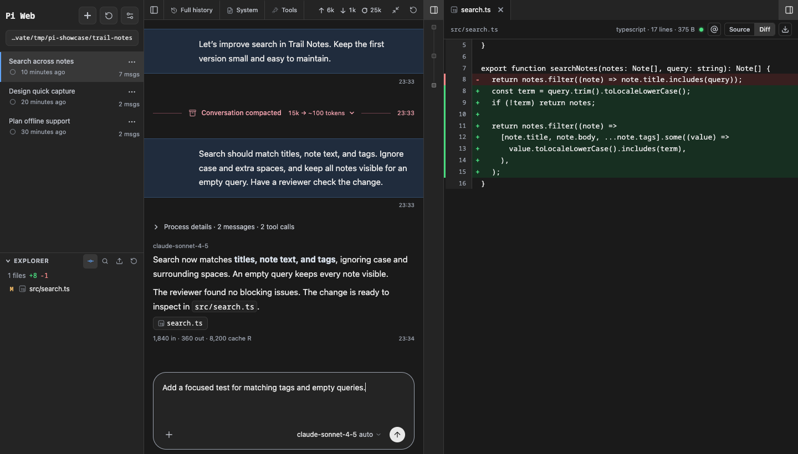
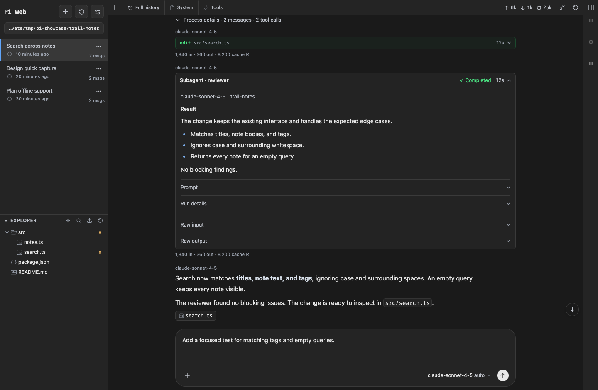
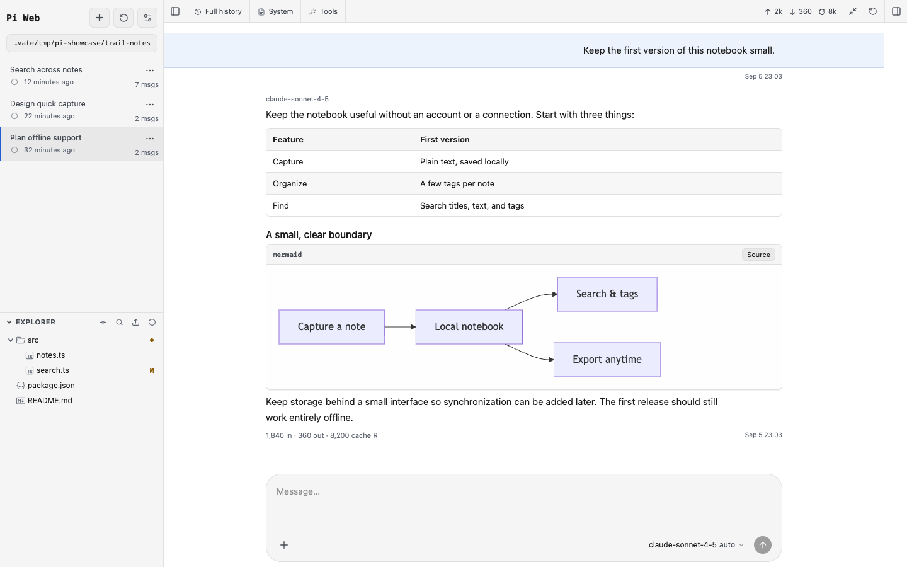
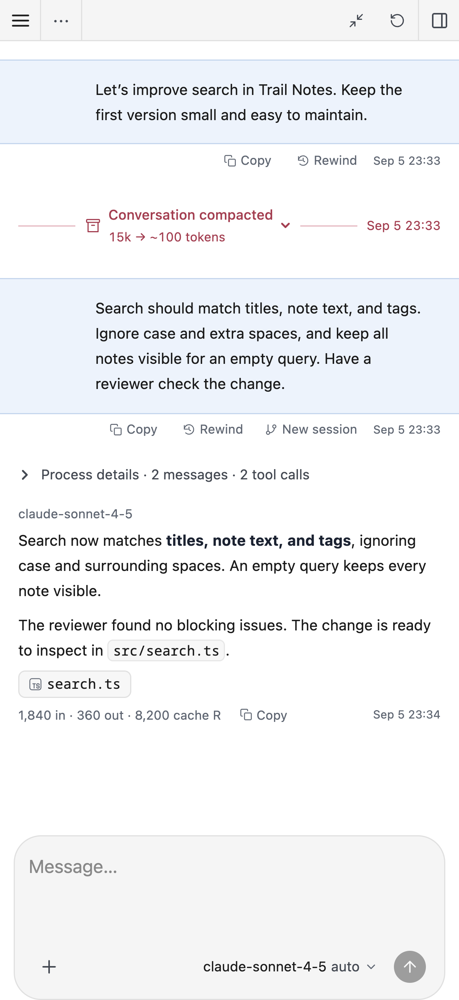

# Pi Web

**Your Pi conversations, project files, and changes in one clear workspace.**

Read the answer. Open the diff beside it. Follow up while the details are still in view. Pi Web gives your [Pi coding agent](https://github.com/earendil-works/pi) a browser workspace built around the conversation and the work it produces.

It uses the Pi configuration and session files already on your computer. Pick up a terminal session in the browser, choose a model, and keep going without importing conversations or maintaining a second set of settings.

**[Get started](#get-started)** · [Explore the interface](#look-closer)



*Review the change in context, with the next request ready in the composer. All screenshots use the current UI with fictional sessions in a local example project.*

## Why Pi Web

- **Little magic.** Pi's session files stay authoritative. Live turns run through Pi's SDK in the server process, and tools and orchestration come from Pi and your extensions. The browser gives you access to that work without adding another agent system.
- **Care in the details.** Your messages stand out, compaction appears as a quiet divider, and process details fold away when you want the answer. Tool output, diffs, and subagent results have their own views. Model and reasoning controls sit in the composer; history, context, and files stay within reach.
- **Work only when needed.** Browsing saved sessions does not start an agent. The session list reads bounded metadata, conversation history loads progressively, and live updates stream to the browser. This avoids agent startup just to browse and limits how much history the browser has to render at once.

This is a personalized fork of [agegr/pi-web](https://github.com/agegr/pi-web), shaped around its maintainer's daily workflow. It is not intended to stay compatible with upstream.

## Look closer

### Follow the work at your own pace

Expand process details to inspect a tool call or a subagent's result. Prompts, run details, and raw output stay available behind their own disclosures, so you can go deeper without losing your place.



*Subagent tools come from your installed Pi extensions. Pi Web gives their results a place in the conversation.*

### Make room for the idea

Tables, highlighted code, and Mermaid previews make plans easier to read and discuss. Switch a diagram between source and preview in place. Choose light, dark, or system appearance to suit your workspace.



### Keep the conversation close

On a small screen, the conversation takes the space it needs. Session and file controls remain within reach, message actions stay visible, and the composer keeps model and reasoning choices together. Install Pi Web as a PWA for an app window of its own.

<p align="center">
  
</p>

*The mobile layout, shown in browser emulation. Pi Web still runs on your host computer; see [Security](#security) before making it reachable from another device.*

## What you can do

- Browse, resume, rename, export, fork, clone, and delete Pi sessions. Rewind a conversation to an earlier message or explore its full history. Sessions from the same repository stay together.
- Run agent turns with model, reasoning-level, and tool controls. You can steer work in progress, queue a follow-up, compact context, stop a run, attach images, and use slash commands.
- Read the result without losing the process. Expand reasoning, tool calls, command output, and subagent results, with token usage, context, and active time available alongside them.
- Work with project files beside the conversation. Browse or upload files, preview common source and document formats, inspect Git changes, and insert file or line references into the composer.
- Select existing working folders and Git worktrees from one project picker. A session remains readable even if its original folder no longer exists.
- Manage Pi skills and plugin packages for the global scope or a trusted project. Choose between Chat only, Read only, Default, and Full tool presets.
- Install Pi Web as a PWA and receive browser notifications when a task finishes or an extension needs input.

## Get started

Pi Web requires Node.js 22.19.0 or newer, npm, and a separate Pi installation. Install Pi and make sure its `pi` executable is on `PATH`:

```bash
npm install -g --ignore-scripts @earendil-works/pi-coding-agent @earendil-works/pi-server
```

Pi Web validates the host installation as a set and requires `@earendil-works/pi-server` alongside Pi. With a version manager that keeps each tool in its own directory, such as mise, install both as separate tools and run Pi Web from a shell where that manager is active.

If Pi does not have a model provider yet, configure one in the Pi terminal. Pi Web ignores any `pi` left in the checkout's `node_modules/.bin`, then uses the first matching `pi` executable on `PATH` (with executable extensions from `PATHEXT` on Windows) and loads that installation's packages in-process. A version-manager shim that is not itself inside Pi's package, such as `mise`'s generic shim directory, is reported as an error rather than searched past.

Pi Web supports Linux, macOS, and Windows. Android and Termux are not supported.

Clone this fork and start the development server:

```bash
git clone https://github.com/mjakl/pi-web.git
cd pi-web
npm install
npm run dev
```

Open [http://127.0.0.1:30141](http://127.0.0.1:30141) when the server is ready. For the production server and installable PWA, stop the development server, then run:

```bash
npm run build
npm start
```

To update a checkout, stop the server and refresh the code and dependencies:

```bash
git pull --ff-only
npm install
```

Then restart the development server, or rebuild before starting the production server. The checkout installs no Pi packages of its own: `npm install`, `npm run dev`, `npm run build`, and `npm test` point the checkout at the Pi found on `PATH`, so updating Pi is enough to update what Pi Web runs.

## What stays with Pi and Git

- **Worktrees and branches:** Pi Web discovers existing worktrees and switches between their folders. It does not create, delete, prune, or change branches in a worktree. Use Git or another worktree tool for those operations. See [Worktrees in Pi Web](./docs/worktrees.md).
- **Provider accounts and model configuration:** Sign in, add API keys, and edit provider or model metadata in the Pi terminal. Pi Web does not read, write, or serve credentials; it lists the models made available by Pi and lets you select one for a session.
- **Agent extensions:** Tools and subagent orchestration come from Pi and the extensions you install. This fork does not add a separate subagent runtime or profile editor.
- **Updates:** Update the checkout and your host Pi installation with their normal tools, then restart Pi Web. There is no browser-based updater.

## Data, files, and network access

- Pi Web reads Pi data from `~/.pi/agent` by default. Set `PI_CODING_AGENT_DIR` before startup to use another agent directory.
- Session files stay under Pi's `sessions/<encoded-cwd>/` directories. Pi Web must be able to read the recorded working directories.
- The file browser is limited to working directories and known project or session roots. It is not a general filesystem browser.
- Type `@` in the composer to find project files. `@~/`, `@/`, `@./`, and `@../` complete paths one directory at a time within paths Pi Web can list.
- Server-side model and API requests honor `HTTP_PROXY`, `HTTPS_PROXY`, and `NO_PROXY`.

Checkout scripts, including the explicit LAN variants, are listed in [`package.json`](./package.json).

## Security

Pi Web can run agent tools and project commands. It has no user accounts, login screen, or built-in authentication, and does not restrict request Host or Origin headers. Keep the default `127.0.0.1` binding unless you have a trusted network or an external access-control layer.

Project resources can run local code. Pi Web leaves project extensions, skills, and other trust-requiring resources disabled until you trust the project. Trust only repositories you control or have reviewed.

## Maintaining a fork

This repository is not seeking outside contributions. If Pi Web suits you, fork it and adapt your copy. Architecture notes, module ownership, maintenance checks, and development constraints are in [`AGENTS.md`](./AGENTS.md).

## License

[MIT](./LICENSE)
